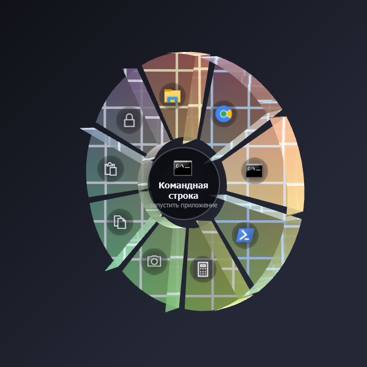

# Udobl — Radial Gesture Menu

A tiny, portable Windows tray app that turns the **middle mouse button** into a
beautiful, glassy radial "pie" menu — like the gesture wheels in games.

> Hold the middle mouse button anywhere → a tilted glass ring fades in around the
> cursor. Move toward a slice, **release** to run it. No extra click needed.
> A quick middle-click still behaves like a normal middle-click.



## Why it's "from the box"

* **WPF on .NET Framework 4.8** — preinstalled on every Windows 10 (1903+) and
  Windows 11. Nothing to install.
* **One small `.exe`**, fully portable. All dependencies are already in Windows.
* Low CPU: the ring only renders while you hold the button; tracking is a light
  background sample every 1.5 s.

## Features

* **Glass radial menu** — translucent gradient slices, 3D tilt, pop-in animation,
  hover-by-angle highlight, accent glow. The center hub shows what you're about to do.
* **Hold-to-open / release-to-select** — no click. Release in the center (or
  right-click / Esc-style move back) to cancel.
* **Action types** per slice:
  * **Launch app** — path/exe (env vars, `.lnk`, Store apps via shell execute)
  * **Open URL** — opens your default browser (`youtube.com` → `https://youtube.com`)
  * **Run command** — any command line (via `cmd /c`)
  * **Send hotkey** — e.g. `Ctrl+Shift+T`, `Win+D`, `VolumeUp`, `MediaPlayPause`
* **Usage tracking + suggestions** — learns which apps you use and (best-effort,
  via UI Automation) which sites you visit, then auto-fills empty ring slots and
  surfaces them in the **Suggestions** tab with one-click *Pin*.
* **Exceptions** — list apps (by process name) where the gesture stays a normal
  middle click.
* **Customizable** — tilt, dead-zone, max slices, hold time, accent color, glyphs
  (any emoji / character), per-slice color.
* **Run at startup** toggle, single-instance, portable JSON config.

## Build

```powershell
powershell -ExecutionPolicy Bypass -File build.ps1
```

The portable exe lands in `.\dist\Udobl.exe`. Or directly:

```powershell
dotnet build Udobl.csproj -c Release
```

(Requires the .NET SDK only to *build*; the resulting exe runs on any Win10/11
with just the built-in .NET Framework 4.8.)

## Run

Double-click `Udobl.exe`. It sits in the system tray (circle icon). Right-click the
tray icon for **Settings**, enable/disable, run-at-startup, and exit.
Config and stats are saved next to the exe (portable), or in `%APPDATA%\Udobl`
if the exe folder isn't writable.

## Notes / limits

* Works at normal user privileges. It cannot draw over windows running **as
  administrator** (a standard Windows hook limitation) — run Udobl elevated too if
  you need that.
* DPI: uses system-DPI awareness, so placement is exact on single-monitor and
  same-scale multi-monitor setups.
* Site tracking reads the browser address bar via UI Automation; it's best-effort
  and can be turned off in Settings → Behavior.

## Project layout

```
Udobl.csproj          net48 WPF, pure-code (no XAML), framework refs only
app.manifest          asInvoker + system DPI awareness
src/Native/           P/Invoke, low-level mouse hook, SendInput, window helpers
src/Core/             config, JSON, actions, usage tracking, suggestions
src/UI/               radial menu window, settings window, tray icon
src/App.cs            entry point, gesture state machine, wiring
build.ps1             one-command build to .\dist
```
